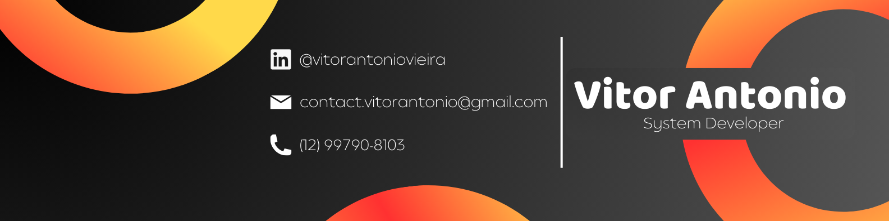

# 
 🎈 Olá, eu sou o Vitor! 

🌍 Uso ciência e tecnologia para resolver desafios da sociedade e da indústria 💻 Registro da evolução de meus projetos, estudos e contribuições à comunidade 🤝 Acredito no trabalho em equipe, então fique à vontade para colaborar nos meus repositórios 🤖 FIRST® Alumn, ex-competidor e mentor da equipe Taiada Nexus

# 🏆 Experiências e conquistas:

# 🧰 `Ferramentas`
                                

# `Principais Projetos`

  
  
  
  
  

<!-- Proudly created with GPRM ( https://gprm.itsvg.in ) -->
